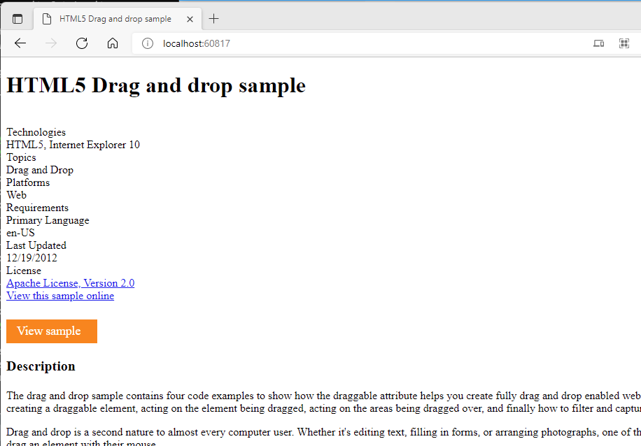

# Notes for basic static web server

## Build a basic NGINX server

Create the directory and Dockerfile

```bash
mkdir demo
cd demo
touch Dockerfile
wget 'https://github.com/bailey572/devops/blob/main/docker/demo/index.nginx-debian.html'
```

## Populate the Dockerfile

Edit the Dockerfile created earlier with the touch command.

```bash
FROM ubuntu
RUN apt update
RUN apt install -y nginx
COPY index.nginx-debian.html /var/www/html
CMD nginx -g 'daemon off;'
EXPOSE 80
```

Note that all Docker commands placed in the Dockerfile are all ***CAPS***.  This by convention and not required as commands in a Dockerfile are not case sensitive but is quite helpful for the human reader.

1. FROM ubuntu

The FROM keyboard specifies the based image we will be using. In this case it is the official ubuntu image from [Docker Hub](https://hub.docker.com/_/ubuntu).  A copy will be downloaded locally and all following operations will be applied to the local image.  The FROM instruction initializes a new build stage and sets the Base Image for subsequent instructions. As such, a valid Dockerfile must start with a FROM instruction. 

2. RUN apt update

Docker will execute the apt update command as root on the locally downloaded Ubuntu image using the ***RUN*** command.  The RUN instruction will execute any commands in a new layer on top of the current image and commit the results.

3. RUN apt install -y nginx

Docker will execute the install command against the local image to add the nginx package.  Nginx is a simple web server that we will configure and leverage to serve up our static web page.

4. COPY index.nginx-debian.html /var/www/html

The COPY instruction copies new files or directories from \<src> and adds them to the filesystem of the container at the path \<dest>.  If the location specified in \<dest> does not exist within the container, docker will create it.  In this case it is taking our example html file and inserting it into the image.

5. CMD nginx -g 'daemon off;'

The CMD keyword is used to start the nginx instance in our image on run.  
The main purpose of a CMD is to provide defaults for an executing container. These defaults can include an executable, or they can omit the executable, in which case you must specify an ENTRYPOINT instruction as well.  Please note, there can only be ***ONE*** CMD in a dockerfile, if multiple are found, then only the last one will be executed.

By default, the nginx command will execute and spin off helper jobs before executing in the background.  As the life of a docker instance is only as long as the running command this default behavior would cause our instance to start, run nginx, and then shut down.  Passing the daemon off command will keep the nginx process in the foreground.

6. EXPOSE 80

Our final instruction EXPOSE, informs Docker that the container listens on the specified network ports at runtime. You can specify whether the port listens on TCP or UDP, and the default is TCP if the protocol is not specified.  
In this case we are choosing port 80 using the default TCP protocol.

## Build the new image

To build the image, ensure you are in the root directory containing the Dockerfile and issue the following command.

```bash
docker build -t="bailey572/static_web:v1" .
```

This will pull down the ubuntu image and begin executing the commands to build our new docker image.
The ***-t=*** option is used to specify the new image name.  The ***:v1*** appends a version tag to the image.

If everything went right, you should see similar output.

```bash
[+] Building 102.2s (10/10) FINISHED
 => [internal] load build definition from Dockerfile                                                                               0.0s
 => => transferring dockerfile: 177B                                                                                               0.0s
 => [internal] load .dockerignore                                                                                                  0.0s
 => => transferring context: 2B                                                                                                    0.0s
 => [internal] load metadata for docker.io/library/ubuntu:latest                                                                  22.3s
 => [auth] library/ubuntu:pull token for registry-1.docker.io                                                                      0.0s
 => [internal] load build context                                                                                                  0.0s
 => => transferring context: 13.31kB                                                                                               0.0s
 => [1/4] FROM docker.io/library/ubuntu@sha256:b5a61709a9a44284d88fb12e5c48db0409cfad5b69d4ff8224077c57302df9cf                    2.6s
 => => resolve docker.io/library/ubuntu@sha256:b5a61709a9a44284d88fb12e5c48db0409cfad5b69d4ff8224077c57302df9cf                    0.0s
 => => sha256:57df66b9fc9ce2947e434b4aa02dbe16f6685e20db0c170917d4a1962a5fe6a9 529B / 529B                                         0.0s
 => => sha256:d13c942271d66cb0954c3ba93e143cd253421fe0772b8bed32c4c0077a546d4d 1.46kB / 1.46kB                                     0.0s
 => => sha256:ea362f368469f909a95f9a6e54ebe0121ce0a8e3c30583dd9c5fb35b14544dec 28.57MB / 28.57MB                                   1.5s
 => => sha256:b5a61709a9a44284d88fb12e5c48db0409cfad5b69d4ff8224077c57302df9cf 1.42kB / 1.42kB                                     0.0s
 => => extracting sha256:ea362f368469f909a95f9a6e54ebe0121ce0a8e3c30583dd9c5fb35b14544dec                                          1.0s
 => [2/4] RUN apt update                                                                                                          36.7s
 => [3/4] RUN apt install -y nginx                                                                                                39.9s
 => [4/4] COPY index.nginx-debian.html /var/www/html                                                                               0.0s
 => exporting to image                                                                                                             0.5s
 => => exporting layers                                                                                                            0.5s
 => => writing image sha256:ce0fa0135a1f832e26bb00812e016e13fa39961c69a222c857b31273f0c8f0a5                                       0.0s
 => => naming to docker.io/bailey572/static_web:v1                                                                                 0.0s
```

If you look closely, you will notice the first four instructions from the Dockerfile along with the creation of the final image.  The last two steps, CMD & EXPOSE, are not part of the build but the configuration and are exercise during the run portion of an instance.

Issuing the docker images command will display all available images including our newly created one.

```bash
$docker images
REPOSITORY             TAG       IMAGE ID       CREATED         SIZE
bailey572/static_web   v1        ce0fa0135a1f   5 minutes ago   165MB
```

## Run an instance of the new image

Now that we have an image to work with, we can run as many instances as we wish based on it.  To do so, issue the docker command with the ***run*** option.  The ***-d*** flag tells docker to issue the run detached to keep from locking up our terminal.

```bash
docker run -d -p 80 --name static_web ce0fa0135a1f
```

Now verify that it is successfully running with the ***ps*** option.

```bash
$ docker ps
CONTAINER ID   IMAGE          COMMAND                  CREATED              STATUS              PORTS                   NAMES
c1043d829ae6   ce0fa0135a1f   "/bin/sh -c 'nginx -…"   About a minute ago   Up About a minute   0.0.0.0:60817->80/tcp   static_web
```

As you can see, an instance, static_web, is currently running based on our created image named c1043d829ae6, with the nginx command issued to start our web server.

Docker has assigned a port mapping the host network to the running instance, 60817, and mapped it to the containers instance's port 80 we exposed during the image build.

To view the web server in action open a browser and got to http://localhost:60817/ or wherever your port was mapped to.



To clean up the instance, go ahead and stop and then remove it.  Below is a capture of a console doing a listing, then issuing a stop command, before finally removing it and listing instances again.  Please note, if you just want to stop the instance and run it again later, you can exit at the stop command and later issue a ***docker start static_web*** command.

```bash
$ docker ps -a
CONTAINER ID   IMAGE          COMMAND                  CREATED          STATUS         PORTS                   NAMES
c1043d829ae6   ce0fa0135a1f   "/bin/sh -c 'nginx -…"   41 minutes ago   Up 2 minutes   0.0.0.0:52295->80/tcp   static_web
$ docker stop static_web
static_web
$ docker rm static_web
static_web
$ docker ps -a
CONTAINER ID   IMAGE     COMMAND   CREATED   STATUS    PORTS     NAMES
$
```

This will not impact the built image.  New instances can be created by issuing the run command again.
